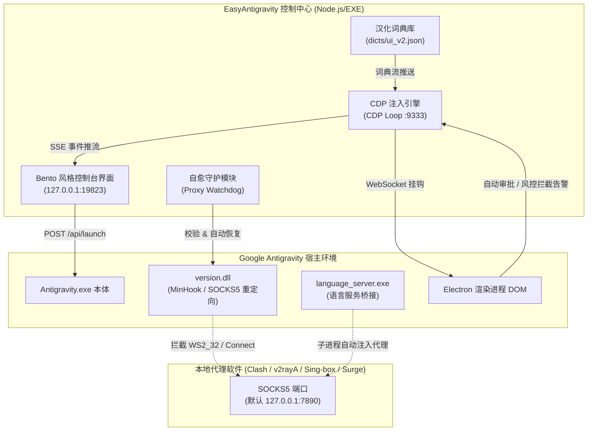

# 🚀 EasyAntigravity (EasyAG)

<p align="center">
  
</p>

<p align="center">
  <strong>专为 Google Antigravity 打造的一键式增强启动器与免 TUN 代理守护中心</strong>
</p>

<p align="center">
  
  
  
  
</p>

---

## 📖 简介

**EasyAntigravity** 是一个轻量级、无侵入的 Google Antigravity 客户端增强启动器与运行守护引擎。

在使用 Google Antigravity 进行日常 AI 结对编程时，国内开发者常常面临诸多痛点：
- **网络门槛高**：官方客户端依赖直连 Google 服务，必须开启繁琐全局 TUN / 虚拟网卡代理模式；
- **更新常失效**：官方客户端静默后台热更新后，常常会直接抹除原先放入目录中的代理补丁文件；
- **全英文界面**：缺乏原生中文语言包，阅读配置和交互时门槛较高；
- **交互频繁打断**：AI 读写文件、执行命令时频繁弹出授权确认，需要反复手动点击放行；若一味盲目允许，又可能存在误执行恶意或破坏性命令的安全隐患。

**EasyAntigravity 专为解决上述痛点而生！** 它采用外部启动与调试注入架构，不修改官方 ASAR 核心源码包，提供**免 TUN 本地代理自动路由、补丁防抹除自愈守卫、实时 DOM 深度汉化、全自动智能审批**以及**毫秒级高危破坏命令熔断拦截**。

---

## ✨ 核心特性

| 功能特性 | 说明描述 |
| :--- | :--- |
| 🛡️ **免 TUN 代理自愈守卫** | 基于动态链接库劫持（`version.dll`）与 API Hook，将核心进程网络重定向至本地 SOCKS5 代理。客户端静默热更新后自动秒级检测并从备份自愈恢复，免除反复手动重配烦恼。 |
| 🌐 **无侵入实时 DOM 汉化** | 通过 Chrome DevTools Protocol (CDP) WebSocket 注入字典引擎，实时高效递归翻译界面文本、Placeholder 与 Title，覆盖数千条词条，随官方版本无感热更新。 |
| ⚡ **自动化无感审批放行** | 自动识别 AI 操作卡片（如 `Allow reading`、`Yes, allow`、`Run`、`Accept` 等），支持预设策略自动选定（仅本次 / 全局始终允许等）并一键提交，解放双手。 |
| 🚨 **高危破坏命令安全熔断** | 自动化放行前对终端命令进行正则风控扫描，一旦匹配 `rm -rf`、`del /s /q`、`format`、`drop database`、`git push -f` 等高危动作，毫秒级熔断拦截并告警。 |
| 🎨 **赛博 Bento 风格极简 UI** | 现代暗黑毛玻璃悬浮控制台，基于 Edge App 模式秒级唤起无边框轻量窗口，支持一键端口切换与运行状态呼吸胶囊指示。 |
| 📋 **实时 SSE 运行审计日志** | 采用 Server-Sent Events 流式传输，清晰输出代理状态、汉化装载、自动放行记录与安全熔断告警，操作痕迹一目了然。 |

---

## 🏗️ 架构原理解析



---

## 📦 目录结构说明

```text
EasyAntigravity/
├── assets/                  # 界面图标与 LOGO 资产 (ICO/PNG)
├── backup/                  # 补丁与代理配置安全备份
│   ├── config.json          # 代理规则与注入配置文件备份
│   └── version.dll          # 针对网络 Hook 的代理劫持库备份
├── dicts/                   # 本地化汉化词典
│   ├── common.json          # 常用基础对照字典
│   └── ui_v2.json           # Antigravity 界面深度定制汉化字典
├── index.html               # 现代化控制中心前端界面 (HTML5/CSS3)
├── server.js                # 控制台核心服务、CDP 挂钩与守护逻辑
├── 启动器.vbs               # Windows 静默后台无黑框启动脚本
├── config.json              # 当前代理注入生效配置
├── version.dll              # 当前本地代理注入 DLL
├── package.json             # Node.js 依赖配置
├── EasyAntigravity.exe      # 单文件独立绿色发行版 (通过 pkg 打包)
├── AG启动失败排查报告.md    # 历史踩坑排查与运行库诊断技术文档
└── 个人介绍.md              # 开发者个人简介
```

---

## 🚀 快速开始

### 方式一：使用单文件绿色版（推荐普通用户）

1. 在 GitHub Releases 下载最新的 `EasyAntigravity.zip`，解压到任意非中文无空格目录。
2. 确保本地代理客户端已启动（例如 Clash / v2rayN / Mihomo），并开启了本地 SOCKS5 端口（默认 `7890`）。
3. 双击运行 `EasyAntigravity.exe`（或双击 `启动器.vbs` 免黑框唤起）。
4. 系统将自动弹出控制台，确认代理端口无误后，点击 **「🚀 启动 Antigravity 本体」** 即可。

### 方式二：通过源码运行（适合开发者）

#### 1. 前置环境准备
- **操作系统**：Windows 10 / 11 (x64)
- **Node.js**：v18.0.0 或更高版本
- **Google Antigravity**：默认安装在 `%LOCALAPPDATA%\Programs\antigravity\`

#### 2. 克隆与安装依赖
```bash
git clone https://github.com/your-username/EasyAntigravity.git
cd EasyAntigravity
npm install
```

#### 3. 启动服务
```bash
# 方式 A：直接通过 Node 启动
node server.js

# 方式 B：后台无命令行黑框唤起
cscript //nologo 启动器.vbs
```
服务默认监听在 `http://127.0.0.1:19823`，并会自动唤起基于 Edge 极简窗口呈现的管理界面。

---

## ⚙️ 配置说明

在控制中心面板或 `config.json` 中可对以下选项进行精细化调整：

### 1. 代理端口配置 (`config.json`)
```json
{
  "proxy": {
    "host": "127.0.0.1",
    "port": 7890,
    "type": "socks5"
  },
  "target_processes": [
    "language_server_windows",
    "language_server.exe",
    "Antigravity.exe",
    "node.exe"
  ]
}
```
> [!TIP]
> 控制中心界面提供了 `7890`、`7897`、`10808` 等常见端口快捷按钮，输入框失焦后将自动热同步修改当前及备份目录配置，无需手动编辑 JSON。

### 2. 自动化审批策略
在界面卡片中可设定「复合权限自动选定」的偏好层级：
- **选项 1**：仅允许本次 (`Allow this time`)
- **选项 2**：对话中始终允许 (`Always allow in conversation`)
- **选项 3**：项目中始终允许 (`Always allow in workspace`)
- **选项 4**：全局始终允许 (`Always allow globally` - 默认推荐)

### 3. 高危命令防御正则
内置安全熔断引擎会对即将放行的脚本及终端指令进行模式匹配：
```javascript
const DANGEROUS_PATTERNS = [
  /\brm\s+(-[a-zA-Z]*r[a-zA-Z]*f|--force)/i,
  /\b(del|rd|rmdir)\s+.*\/[sqf]/i,
  /\b(format|diskpart|mkfs|wipefs|shred)\b/i,
  /\bdrop\s+(database|table)\b/i,
  /\bgit\s+push\s+.*(-f|--force)\b/i,
  /\b(shutdown|stop-computer)\b/i
];
```
检测到命中特征时，将**立即阻止自动点击提交**，并在运行日志中高亮显示安全告警，交由用户亲自确认。

---

## 🛠️ 打包与分发指南

如果对源码进行了二次开发，可以使用 [`@yao-pkg/pkg`](https://github.com/yao-pkg/pkg) 重新构建无 Node.js 运行时依赖的单文件 `.exe`：

```bash
# 全局安装 pkg
npm install -g @yao-pkg/pkg

# 打包为 Windows x64 独立可执行程序
pkg . --targets node18-win-x64 --output EasyAntigravity.exe
```

> [!NOTE]
> 项目代码中已对 `process.pkg` 运行环境做了路径锚定处理（`ROOT_DIR = process.pkg ? path.dirname(process.execPath) : __dirname;`），分发时只需将生成的 `EasyAntigravity.exe` 与 `backup/`、`dicts/`、`index.html` 以及 `assets/` 一同压缩分发即可。

---

## ❓ 常见问题排查 (FAQ)

### Q1：点击「启动 Antigravity 本体」后闪退，进程退出码为 `0xC0000005`？
> [!IMPORTANT]
> **绝大多数情况下并非 Antigravity 版本与 DLL 协议不兼容，而是 Windows 系统 C++ 运行时版本错配！**

- **现象**：`Antigravity.exe` 启动瞬间退出，WER Windows 故障报告显示崩溃模块为 `MSVCP140.dll`，异常代码 `c0000005`。
- **根因分析**：`version.dll` 属于 C++ 编写，加载时会调用系统的 `MSVCP140.dll`。若本机的 `C:\Windows\System32\MSVCP140.dll` 版本过于陈旧（例如残留 VS2015 老版本），而其他组件依赖 VC++ 2022 运行时，将引发 CRT 混合调用访问违规崩溃。
- **解决方案**：
  1. 下载并安装微软官方最新版 [Microsoft Visual C++ 2015-2022 Redistributable (x64)](https://aka.ms/vs/17/release/vc_redist.x64.exe)；
  2. 修复或重启计算机后重新启动 EasyAntigravity。

### Q2：提示安全软件拦截或 DLL 注入失败？
- `version.dll` 采用 Windows 经典的 DLL 劫持注入机制，部分严格的安全防护软件（如火绒高级 HIPS 规则、360、深信服 EasyConnect 虚拟网卡驱动等）可能会拦截本地 API Hook 操作。
- **建议**：将 Antigravity 安装目录及 EasyAntigravity 目录添加至安全防护软件的信任名单。

### Q3：如何扩展汉化字典？
- 汉化字典存储于 `dicts/ui_v2.json` 与 `dicts/common.json`。
- 字典格式为键值对应的 JSON：
  ```json
  {
    "Original English Text": "中文翻译文本"
  }
  ```
- 添加词条后，点击控制台的汉化重新装载或重启 EasyAntigravity 即可即时生效。

---

## 🤝 贡献与感谢

欢迎提交 Issue 与 Pull Request 共同完善 EasyAntigravity！
- 如果你发现了翻译不准确或未汉化的 UI 词条，欢迎向 `dicts/ui_v2.json` 补充词条。
- 如果你有更好的高危拦截规则或网络链路方案，欢迎贡献代码。

## 📄 开源许可

本项目采用 [ISC License](LICENSE) 许可协议。
本项目仅供交流学习与效率提升使用，请勿用于违反当地法律法规及破坏系统安全的用途。
